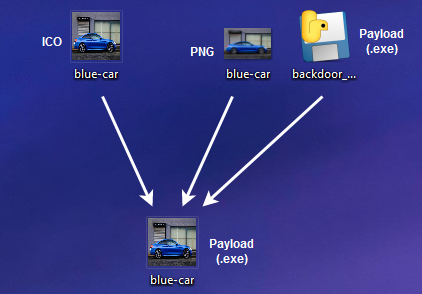
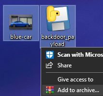

<strong>IMPORTANT:</strong> Please note that this exploit should only be used for educational purposes and should ideally be run on your own LAN.

# What is it?

This is an implementation of backdoor payload, in the form of an executable. The idea is that that the target should click on the executable which will connect to a socket which the attacker has opened. After this the attacker will have full access to the targets file system.

The executable can be disguised as an image to make it more likely the target will click on it. See section "Turning executable into an image".

# Prerequisites

One machine running Kali Linux and another running Windows 10. The attack has only been tested in a scenario where the attacker was using Kali Linux and the target was on a Windows 10 machine.

It might also be a prerequisite that the Windows machine is using English as its default languages, as some languages e.g. swedish showed some difficulties in executing certain commands.

# Step-by-step - running the backdoor exploit

## Step 1

Install pyinstaller if not already installed. PyInstaller bundles a Python application and all its dependencies into a single package. To install it run:

```
pip install pyinstaller
```

## Step 2

Next up compile the backdoor payload into an executable with the help of Pyinstaller.

```
python -m PyInstaller .\backdoor_payload.py --onefile --noconsole
```

This will generate 2 files and 2 folders. In the folder called `dist` you will find the payload that we want to send to the target called `backdoor_payload.exe`.

## Step 3

Start listening for connections to the target machine through first configuring IP_ADDRESS and running the following command:

```
python3 server.py
```

## Step 4

Get `backdoor_payload.exe` to the target machine somehow. This could for example be through sending an email to the target.

After the target has clicked on `backdoor_payload.exe` it should take a maximum of 10 seconds before a connection is setup between the attacker and target. The connection can be confirmed through running `whoami` from within the terminal of the attackers machine.

# Post exploit

To turn off the exploit from within the terminal window of the attacker, or open up task manager on the target system and manually turn of the exploit.

# Turning executable into an image

The idea here is to disguised an executable as an image. When pressing the image the executable, which in this case is a payload we want the target to execute for us, will start to run in the background while the an image will open making the target think they only opened an image.



### <strong>Prerequisites:</strong>

Windows 10 and WinRAR.

## Step 1

Find an image that you like and create an ICO version of it. You should now have one image (PNG or JPEG), one ICO file and one executable you want to use. Example files are given in directory `/images`.

## Step 2

With you mouse mark both the image and executable and right click on them. Choose `Add to archive`.



## Step 3

1. Set the `Archive name` to what ever you want but make sure it got the `.exe` extension, preferably it showed not be any suspicious.
2. Select `ZIP` as `Archive format`
3. Check `Create SFX archive` in `Select Archiving options`

## Step 4

Go to the `Advanced` tab and press `SFX options...`.

1. Go to `Update` tab. Choose ` Extract and update files` and `Overwrite all files`.
2. Go to `Text and icon`. Choose your ICO file as `Load SFX icon from the file`.
3. Go to `Modes`. Check `Unpack to temporary folder` and Choose `Hide all`.
4. Go to `Setup`. Write in `Run after extraction` the following:
   ```
   <FILENAME e.g. blue-car.png>
   <PAYLOAD e.g. backdoor_payload.exe>
   ```
   Now click `OK` then `OK` again.

## Step 5

DONE! Now you should have an executable disguised as an image. Only thing left is to figure out how to get it onto the target system.
